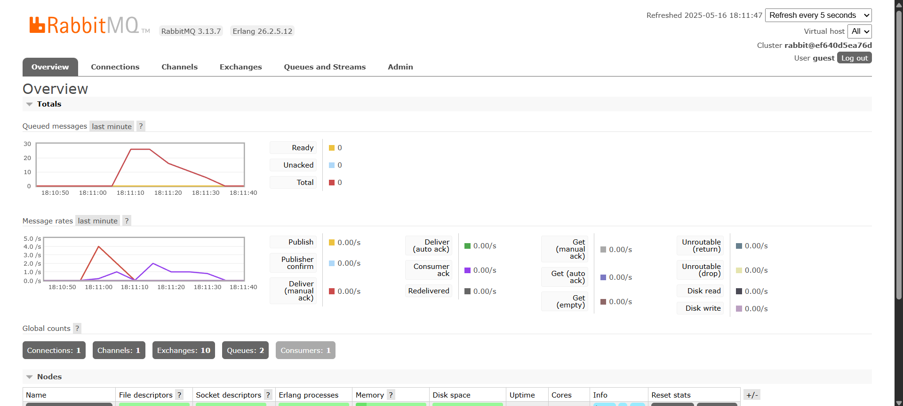
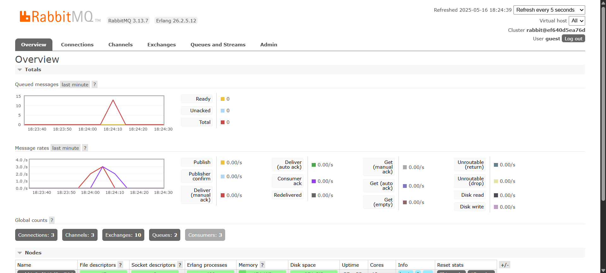

# Module 9 Subscriber

1. What is AMQP?

AMQP is a standard set of rules that allows different computer programs to send and receive messages reliably. It ensures that messages can be passed between systems in a structured way.

------------------------------------

2. What does `guest:guest@localhost:5672` mean?

This string is a common URI or connection string used to specify how to connect to an AMQP broker.

- guest:guest: These are the username (first) and password (second) used to log in.
- localhost: This refers the host address of the AMQP broker. `localhost` meaning the broker runs on the same machine as the client app.s
- 5672: This is the specific port number the service uses for connections.

### Slow Simulation

The "Queued messages" chart displays a total of 25 messages. This is because I have executed the publisher program 5 separate times. Each execution of the publisher sends a batch of 5 UserCreatedEventMessage events to the RabbitMQ broker. As the subscriber fetches and processes these messages one by one, the 25 messages represent the accumulation of these published events that are currently waiting in the queue to be fetched.

### Three Subscribers

With three subscribers being run simultaneously, the messages in the queue are fetched so much faster, since the workload is being distributed between the three. This resulted in a much better performance, therefore reducing the queue messages spike much faster.
An idea to make a better performance would be to publish the messages in a batch, to allow the subscriber to fetch the data as soon as possible.